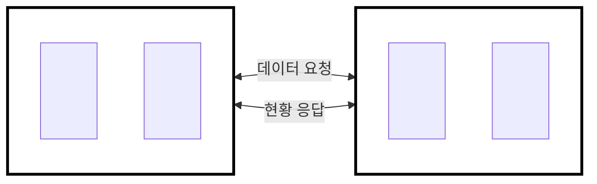
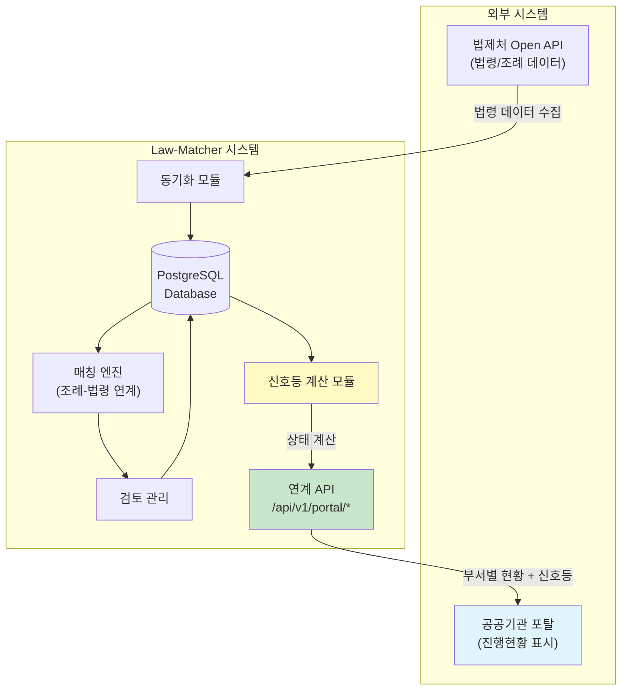
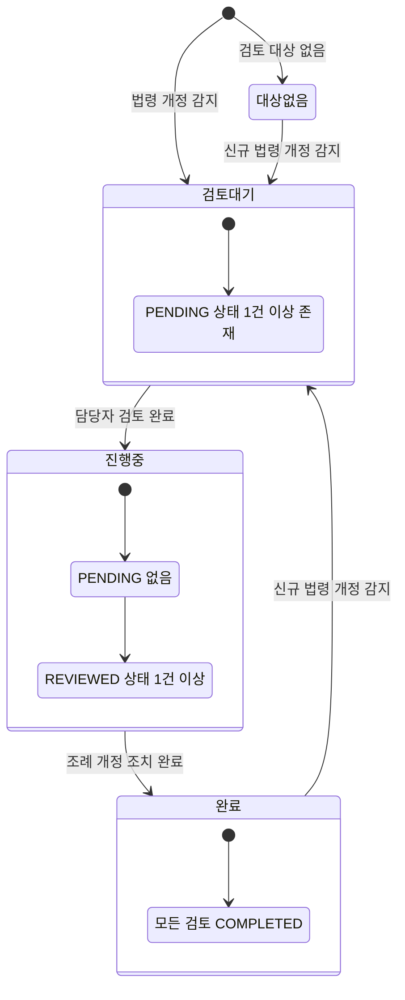
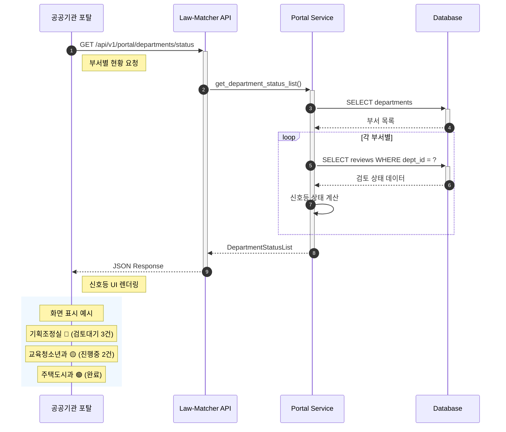
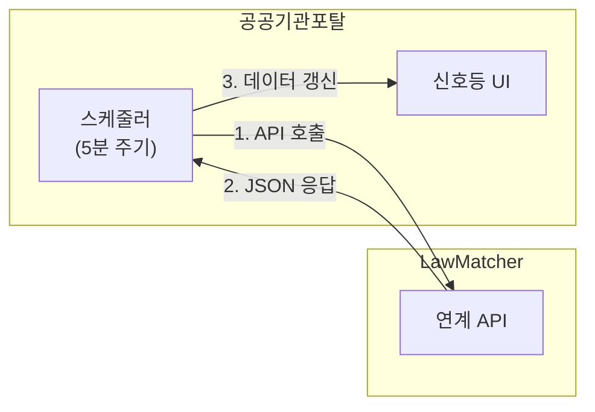
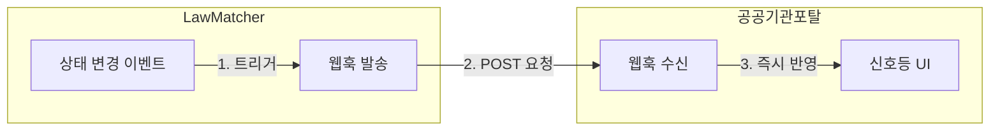

# 공공기관 포탈 연계 시스템 다이어그램

> Law-Matcher 시스템과 공공기관 포탈 간의 데이터 연계 방안

---

## 시스템 연계 개요도



```
┌───────────────────────┐                    ┌───────────────────────┐
│                       │                    │                       │
│                       │   요청 (Request)   │                       │
│                       │  ───────────────>  │                       │
│     공공기관 포탈      │                    │   Law-Matcher 서버    │
│      (새올 서버)       │                    │    (조례 매칭 시스템)  │
│                       │   응답 (Response)  │                       │
│                       │  <───────────────  │                       │
│                       │                    │                       │
└───────────────────────┘                    └───────────────────────┘

         [포탈]                                    [Law-Matcher]
           │                                            │
           │  1. GET /api/v1/portal/departments/status  │
           │ ─────────────────────────────────────────> │
           │                                            │
           │  2. JSON (부서별 신호등 현황)               │
           │ <───────────────────────────────────────── │
           │                                            │
```

### 데이터 흐름 요약

| 방향 | 내용 |
|------|------|
| **포탈 → Law-Matcher** | 부서별 조례 개정 현황 요청 |
| **Law-Matcher → 포탈** | 신호등 상태 포함 JSON 응답 |

---

## 1. 시스템 연계 아키텍처 (상세)

Law-Matcher, 공공기관 포탈, 법제처 API 간의 전체 구조



### 주요 컴포넌트 설명

| 컴포넌트 | 역할 |
|----------|------|
| **법제처 API** | 법령 및 조례 원본 데이터 제공 |
| **동기화 모듈** | 법제처에서 법령 데이터 수집 |
| **매칭 엔진** | 조례와 상위법령 연계 관계 관리 |
| **검토 관리** | 법령 개정 시 조례 검토 상태 관리 |
| **신호등 계산** | 부서별/조례별 진행 상태 계산 |
| **연계 API** | 공공기관 포탈에 데이터 제공 |

---

## 2. 신호등 상태 정의 및 전환

검토 진행 상태를 신호등으로 시각화



### 상태별 의미

| 신호등 | 상태명 | 조건 | 의미 |
|:------:|--------|------|------|
| 빨강 | RED | PENDING 존재 | 즉시 검토 필요 |
| 노랑 | YELLOW | REVIEWED만 존재 | 검토 완료, 조치 진행 중 |
| 초록 | GREEN | 모두 COMPLETED | 모든 조치 완료 |
| 회색 | GRAY | 검토 대상 없음 | 해당 부서 개정 사항 없음 |

---

## 3. 데이터 교환 흐름 (시퀀스 다이어그램)

공공기관 포탈에서 현황을 조회하는 과정



---

## 4. 전송 데이터 명세

### 4.1 부서별 현황 응답 구조

```json
{
  "generated_at": "2026-01-23T10:30:00Z",
  "total_departments": 25,
  "summary": {
    "departments_red": 5,
    "departments_yellow": 8,
    "departments_green": 10,
    "departments_gray": 2,
    "overall_progress_rate": 65.5,
    "urgent_reviews_count": 12
  },
  "departments": [
    {
      "department_id": 1,
      "department_name": "기획조정실",
      "traffic_light": "RED",
      "traffic_light_label": "검토대기",
      "pending_count": 3,
      "reviewed_count": 2,
      "completed_count": 8,
      "high_urgency_count": 2
    }
  ]
}
```

### 4.2 필드 상세 설명

| 필드명 | 타입 | 설명 |
|--------|------|------|
| `department_name` | string | 부서명 |
| `traffic_light` | enum | 신호등 상태 (RED/YELLOW/GREEN/GRAY) |
| `traffic_light_label` | string | 상태 한글명 (검토대기/진행중/완료/대상없음) |
| `pending_count` | int | 검토대기 건수 |
| `reviewed_count` | int | 검토완료(조치중) 건수 |
| `completed_count` | int | 조치완료 건수 |
| `high_urgency_count` | int | 긴급(HIGH) 건수 |
| `overall_progress_rate` | float | 전체 진행률 (%) |

---

## 5. 연계 방식 옵션

### 옵션 A: Pull 방식 (포탈에서 주기적 조회)



**장점:** 구현 단순, Law-Matcher 변경 최소화
**단점:** 실시간성 부족

### 옵션 B: Push 방식 (웹훅)



**장점:** 실시간 반영
**단점:** 포탈에서 웹훅 수신 구현 필요

---

## 6. 포탈 UI 표시 예시

```
┌─────────────────────────────────────────────────────┐
│           조례 개정 진행 현황 대시보드               │
├─────────────────────────────────────────────────────┤
│                                                     │
│  전체 현황                     부서별 현황          │
│  ┌─────────────────┐          ┌──────────────────┐ │
│  │ 🔴 검토대기  5  │          │ 기획조정실    🔴 │ │
│  │ 🟡 진행중    8  │          │ 교육청소년과  🟡 │ │
│  │ 🟢 완료     10  │          │ 주택도시과    🟢 │ │
│  │ ⚫ 대상없음  2  │          │ 복지정책과    🔴 │ │
│  └─────────────────┘          │ 환경녹지과    🟢 │ │
│                               │ ...             │ │
│  진행률: ████████░░ 65%       └──────────────────┘ │
│                                                     │
│  ⚠️ 긴급 검토 필요: 12건                           │
└─────────────────────────────────────────────────────┘
```

---

## 7. 향후 확장 계획

1. **API 엔드포인트 개발** - `/api/v1/portal/*` 구현
2. **인증 체계** - API 키 기반 인증
3. **웹훅 기능** - 상태 변경 시 자동 알림
4. **대시보드 위젯** - 포탈 임베드용 컴포넌트

---

*최종 수정일: 2026-01-23*
