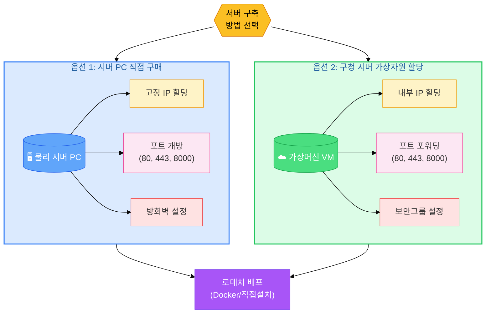
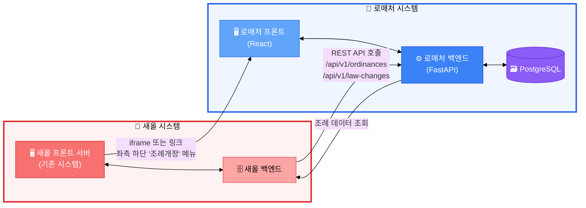
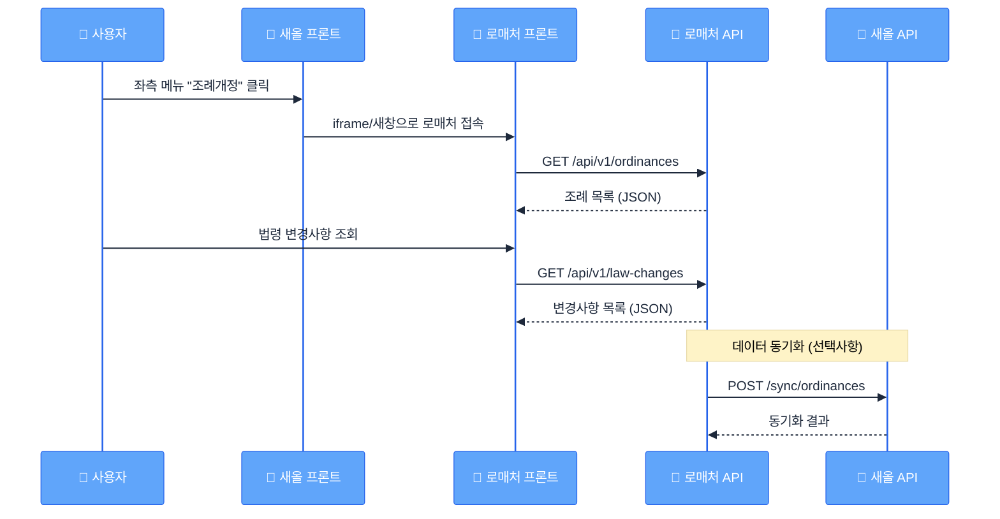
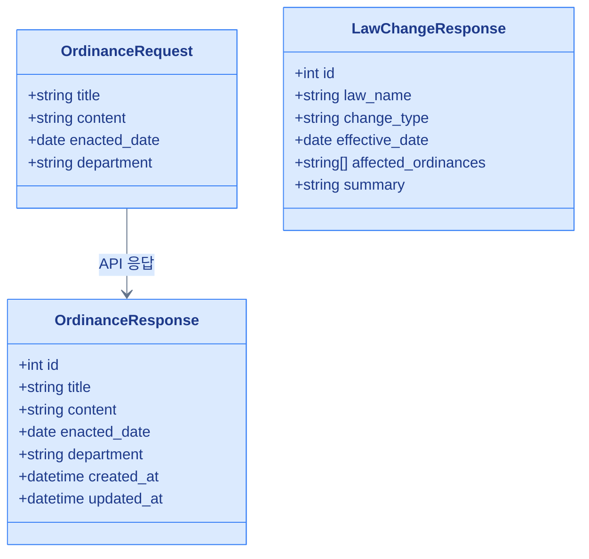
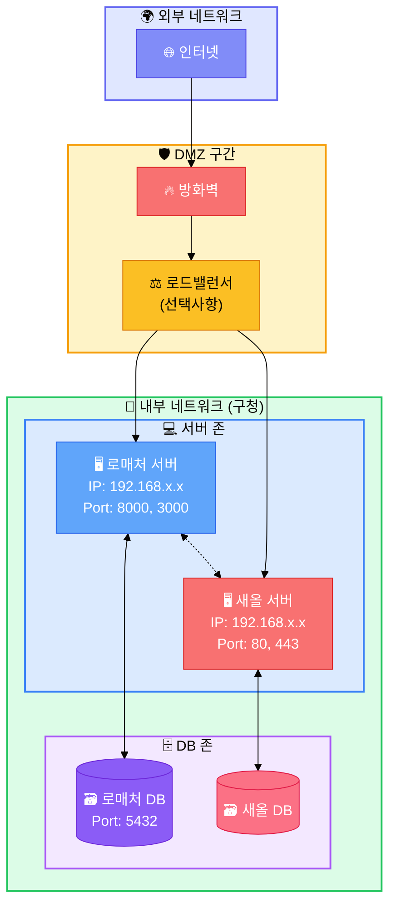

# 로매처 서버 구축 및 연계 다이어그램

## 1. 서버 구축 방법 (옵션 비교)

## 2. 로매처 - 새올 서버 연계 구조

## 3. API 연계 상세

## 4. 데이터 교환 형식

## 5. 네트워크 구성도

---

## 색상 범례

| 색상 | 의미 |
|------|------|
| 🔵 파랑 | 로매처 시스템 |
| 🔴 빨강 | 새올 시스템 |
| 🟡 노랑 | 네트워크 장비 / 설정 |
| 🟢 초록 | 가상자원 / 내부망 |
| 🟣 보라 | 데이터베이스 |

---

## 사용 방법

이 Mermaid 다이어그램은 다음에서 렌더링됩니다:
- **GitHub**: README나 .md 파일에서 자동 렌더링
- **VSCode**: Markdown Preview Enhanced 확장 사용
- **온라인**: [Mermaid Live Editor](https://mermaid.live/)에서 PNG/SVG 내보내기
