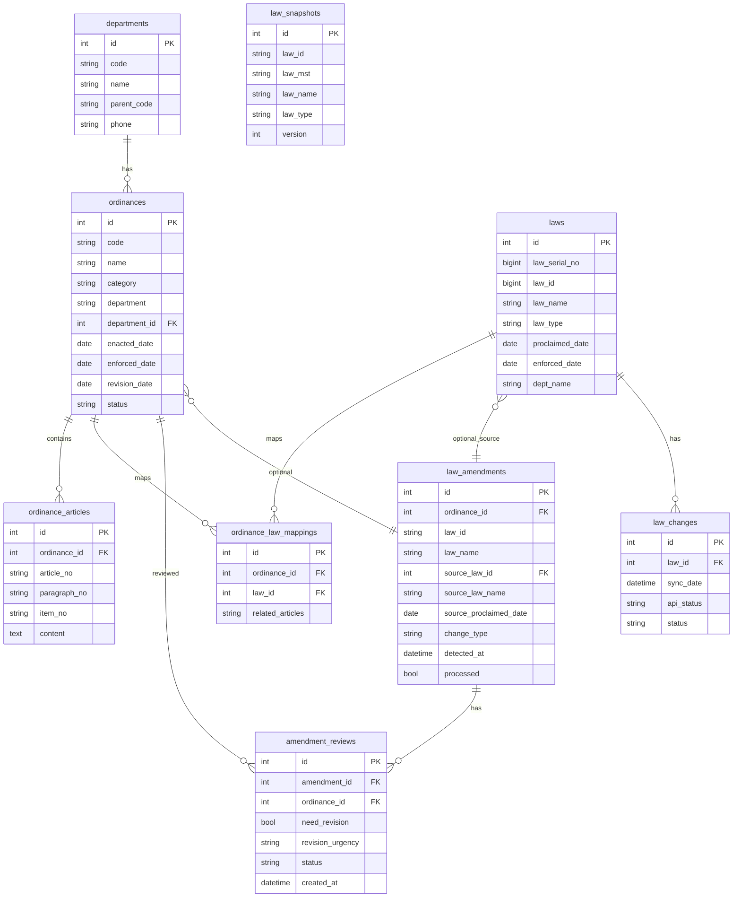

# ERD

```mermaid
erDiagram
  departments {
    int id PK
    string code
    string name
    string parent_code
    string phone
  }

  ordinances {
    int id PK
    string code
    string name
    string category
    string department
    int department_id FK
    date enacted_date
    date enforced_date
    date revision_date
    string status
  }

  ordinance_articles {
    int id PK
    int ordinance_id FK
    string article_no
    string paragraph_no
    string item_no
    text content
  }

  laws {
    int id PK
    bigint law_serial_no
    bigint law_id
    string law_name
    string law_type
    date proclaimed_date
    date enforced_date
    string dept_name
  }

  ordinance_law_mappings {
    int id PK
    int ordinance_id FK
    int law_id FK
    string related_articles
  }

  law_amendments {
    int id PK
    int ordinance_id FK
    string law_id
    string law_name
    int source_law_id FK
    string source_law_name
    date source_proclaimed_date
    string change_type
    datetime detected_at
    bool processed
  }

  amendment_reviews {
    int id PK
    int amendment_id FK
    int ordinance_id FK
    bool need_revision
    string revision_urgency
    string status
    datetime created_at
  }

  law_changes {
    int id PK
    int law_id FK
    datetime sync_date
    string api_status
    string status
  }

  law_snapshots {
    int id PK
    string law_id
    string law_mst
    string law_name
    string law_type
    int version
  }

  departments ||--o{ ordinances : has
  ordinances ||--o{ ordinance_articles : contains
  ordinances ||--o{ ordinance_law_mappings : maps
  laws ||--o{ ordinance_law_mappings : maps

  law_amendments ||--o{ amendment_reviews : has
  ordinances ||--o{ amendment_reviews : reviewed
  ordinances }o--|| law_amendments : optional
  laws }o--|| law_amendments : optional_source

  laws ||--o{ law_changes : has
```
